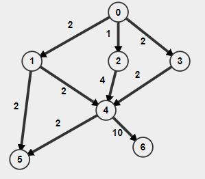

---
jupyter:
  jupytext:
    formats: ipynb,md
    text_representation:
      extension: .md
      format_name: markdown
      format_version: '1.3'
      jupytext_version: 1.16.4
  kernelspec:
    display_name: Python 3 (ipykernel)
    language: python
    name: python3
---

# State Search
## Motivation
Many problems in AI can be defined as follows:

**Given a start state and goal state, find the optimal sequence of actions to take so that the agent reaches the goal state.**

Frequently, we would want the sequence of action to be optimal, which means to say that it is the least cost/highest utility sequence of action that reaches the goal state.


## Nodes
We can formalize the graph that we are searching.
In this graph, it contains nodes, where each node has information on:
* The state of the system
* The parent node of this node
* The action that generated this node
* The actions that can be generated from this node
* The path cost of each action

Thus, by searching, we are traversing the graph, starting from the start node, moving across path which are defined as actions that the agent can take at that state, and finding the least cost path to the goal node.


We define F as the **fringe** or **frontier**, which are the nodes that are to be explored, and E as the **previously explored nodes**.

Note that F is equivalent to the data structure that stores the next visiting vertices (Queue/PriorityQueue), while E is the data structure that stores the previously visited nodes.


## Complications
Since we are dealing with various possible problem formulation, it may be possible that there are multiple goal nodes, or no goal nodes are reachable from the start node.
Also, it is possible that the search place is infinite. For example, in the case of a real life robot navigating the real world space. The possible positions that the robot can take would be infinite, since its coordinates can take any real number. Thus, the analysis of the algorithm will be slightly different from those in the [Algorithm Analysis](../algorithm_analysis/graph_algorithms.ipynb#traversal).


## Types of Searches
There are 2 broad category of state search:
* Tree search
    * Does not remember the state that were visited in another branch
    * Will revisit these previously visited state
    * Requires less memory
* Graph search
    * Remembers previously visited state from another branch
    * Will not visit those previously visited state
    * Requires memory to store these visited states

Note that tree search does not imply that the underlying graph is a tree, this is a rather unfortunate naming convention.

Thus, keep in mind that the searches below can either be the tree search variant or the graph search variant.

## Metric
To judge how good a search algorithm is, we look at 2 specific traits of the search.
We look at the performance under this conditions:
* Graph has finite branching factor
* There exists some goal nodes that are finite depth away from the start

Note that the graph itself may be infinite, but the goal must be in a finite depth away from the start.

### Completeness
A search is **complete** if it always terminates when searching the given graph.
Essentially, it is saying that "if a path to the goal exists, the search should be able to find some (not necessarily optimal) path in finite time".

### Optimality
A search is **optimal** if every path that it returns is the least costs path for that problem.
Note it is possible for a search to be optimal but not complete.

We also need to account for two types of problems: problems that have constant cost for each step, and problems which step cost may not be constant.

### Complexity
The time complexity measures the number of computations that the algorithm need to do when searching;
while the space complexity measures the amount of memory required to run the algorithm.

We model the graph as a tree (even if it is not an actual tree), with depth of $m$ and branching factor of $b$, which is the number of children each node can have.
We also use $d$ to denote the depth of the shallowest solution, since some searches may be able to find the solution without exploring the whole tree.
These parameters will be used in our analysis later for our searches.
Note that $b^m$ can be much larger than the actual search space, since a non-tree search space will result in multiple paths to the same states which increases the branching factor without increasing the number of possible states.

Due to the nature of graph search (we will not revisited states), 
the time complexity will be upper bounded by the size of the search space.


# Uninformed Search
Uninformed searches are searches that do not have prior knowledge of the graph.
Thus, they do not have knowledge of the topology of the search space, such as:
* how far away (exactly or an estimate) the goal is from a given state
* whether the search space is infinite
* whether to goal even exists


## Depth First Search
This is exactly the same as the DFS discussed in [Algorithm Analysis](../algorithm_analysis/graph_algorithms.ipynb#dfs).

However, the small caveat is that DFS tree search is actually recursive backtracking, while DFS graph search is the "DFS" as discussed in that chapter.

### Completeness
DFS is not complete when searching an infinite graph.
It is possible for the search to iteratively search deeper and deeper into the wrong branch of the graph, causing it to not terminate.


### Optimality
Clearly DFS is not optimal, even when the cost of each action is constant

```
1 -- 2 -- 3
|         |
-----------
```

It is possible that we explored `1-2-3` to get a distance of 2 when the optimal solution is `1-3`.

However if the step cost is constant, and the search space is an actual tree, then it will be optimal, as proven in [...].

### Time Complexity
Since it is possible that DFS explores the wrong branch and have to explore the whole tree, the worst time complexity is simply searching the whole tree: $m + m^2 + m^3 + \dots + m^d \leq b(b^m) = O(b^m)$

### Space Complexity
When we are at a node and want to traverse deeper, we need to remember which of the children of the current node have already been visited. Since we need to remember this for each layer, and each layer may need to remember up to $m$ children, the space complexity is $O(bm)$. 

(Technically we can simply remember the index of the last visited children for each layer (we implicitly do this when we use the iterator), to reduce the time complexity to $O(m)$).

### Motivation

Why are we studying DFS even though it is non-optimal and incomplete?

Because:
1. It is better space complexity than BFS, especially when there is high branching factor
2. It might be useful in certain search spaces, where it would be both complete and optimal and thus a better alternative to BFS


<!-- #region -->
### Worked Example



<!-- #endregion -->

Suppose we were to run DFS on the above graph, where the start node is node 0, the end node is node 6, and the children are visited in numerical order.

The nodes explored would be as follows

On tree search: : 0, 1, 5, 4, 5, 6

On graph search: 0, 1, 5, 4, 6

## Depth Limited Search

To combat the issue of DFS exploring a bad path that goes indefinitely, we can limit DFS to only search up to depth $D$ before giving up.
This allows us to explore other shallower path that may contain the solution.

However, this requires us to set a good value for $D$.
If `D` is too low, _ie_ $D < d$, then DLS gives up too quickly and never finds us a solution.
If `D` is too high, then we waste time exploring useless states.
In fact, DFS is a special case when $D = \infty$.

One fascinating trait of DLS is that if we set `D = d`, DLS is both optimal and complete!
A brief explanation is because when we set such a `D`, we avoid the situations which lead to non-optimality and incompleteness;
that is when we chose a non-optimal path and when we chose an infinite path.
When $D = d$, we would give up on both of these paths and thus giving us the desired traits for our search.

*However*, this is a "chicken-and-egg" problem.
If we already know the solution is at depth `d` of a certain value, then why are we even searching?
Thus, the restriction around uninformed search is binding us, and thus we are unable to utilize this special situation to get a highly performant search, as we cannot easily know the value of $D$.

## Time complexity

$O(b^D)$, but only obtains a solution when $D \geq d$

## Space complexity
$O(D)$


## Iterative Deepening Search

However, all hope is not lost.
Recall that DLS only returns us a solution when `D \geq d`.

It follows that we can actually exploit this fact, simply by iterating `D`.

We simply keep incrementing `D` until we get a solution.

This allows us to get an optimal and complete search.

## Time complexity
The time complexity is slightly worse than DLS, as we are repeating the DLS and exploring previous states, 
but we still get $O(b^d)$.

## Space complexity

But the space complexity is $O(d)$ significantly better than BFS's $O(b^n)$


## Breadth First Search
This is exactly the same as the BFS discussed in [Algorithm Analysis](../algorithm_analysis/graph_algorithms.ipynb#bfs). 
The BFS discussed there is the graph search variant.

### Completeness
BFS is complete. 

Suppose the goal node is at depth $d$, even on an infinite graph.
It is clear that BFS will find the goal node once it starts processing layer $d$.

### Optimality

Under any of these conditions, BFS is optimal:
* step cost is constant
* search space is a tree

### Time Complexity
By similar analysis as its completeness, the complexity is $O(b^d)$.

### Space Complexity
Since we need to visit at most $O(b^d)$ nodes to reach the goal, we would need $O(b^d)$ space to store E.

And because F only stores all the nodes that are to be visited at layer $k$ at the k-th step of the search, also that each layer have at most $b^k$ nodes, thus the space needed to store F is $O(b^d)$

<!-- #region -->
### Worked Example


<!-- #endregion -->

The nodes explored would be as follows

On tree search: : 0, 1, 2, 3, 5, 4, 4, 4, 6

On graph search: 0, 1, 2, 3, 5, 4, 6

## Bidirectional search


## Uniform Cost Search
This is exactly the same as the Dijkstra algorithm for single source shortest path, discussed in [Algorithm Analysis](../algorithm_analysis/graph_algorithms.ipynb#dijkstra). 
The UCS discussed there is the graph search variant.

Here, we define $g(n)$ as the true distance of node $n$ from the start, and $\hat g(n)$ as the estimate distance of the node $n$ from the start during the run time of the search (the same as the values that are in the F during run time).

### Pseudocode
```
UCS ( u )
    F ← PQueue ( u ) // Sorted on gˆ[u]
    E ← { u }
    gˆ[u] = 0
    while F not empty
        u ← F. pop ( )
    if GoalTest ( u )
    for all children of u
    
    if v not in E
        if v in F
            gˆ[v] = min ( gˆ[v] , gˆ[u] + c [ u , v ] )
        else
            F.push(v)
            gˆ[v] = gˆ[v] + c [u , v]
    return Failure
```

### Completeness
Complete if every edge has cost $\geq \epsilon$, or else non-goal states may constantly be pushed to F such that the goal node is never explored.

### Optimality
This is optimal, by the same reasoning of Dijkstra's optimality.

### Time Complexity
By the same analysis as BFS, the complexity is $O(b^{d+1})$.

### Space Complexity
By the same analysis as BFS, the complexity is $O(b^{d+1})$.


<!-- #region -->
### Worked Example


<!-- #endregion -->

The nodes explored would be as follows

On tree search: : 0, 2, 1, 3, 4, 4, 5, 5, 5, 6

On graph search: 0, 2, 1, 3, 4, 5, 6


# Informed Search
Informed search have some prior knowledge of the cost needed to reach the goal from a given state.

Thus, they can utilise it to explore less nodes to reach the goal.


## A*
A* is similar to UCS, but instead of using the distance of a node from the start node to determine the order of exploration, it uses the distance + some heuristic on that node.
This heuristic tries to estimate the distance needed to reach the goal from that node.
Thus, A* is choosing the node to explore based on its estimation of the total distance from the start to the goal through this node.

One way to view it is that suppose you want to go from your house to the train station. 
UCS will prompt you to start the search in a circle area around your house, and slowly expand the radius until you find a station.
But suppose you know that the train station somewhere south of your house, then A* will prompt you to search in that general direction for the train station instead of wasting resources searching the north.

Thus, the only modification to UCS is that $f(n)$ is the combined cost of the node $n$, and our F is sorted base on the cost of $\hat f(n)$, and we update $\hat f(n) = \hat g(n) + h(n)$ at each step.

### Pseudocode
```
UCS ( u )
    F ← PQueue ( u ) // Sorted on fˆ[u]
    E ← { u }
    gˆ[u] = 0
    while F not empty
        u ← F. pop ( )
    if GoalTest ( u )
    for all children of u
    
    if v not in E
        if v in F
            gˆ[v] = min ( gˆ[v] , gˆ[u] + c [ u , v ] )
            fˆ[v] = gˆ[v] + h [v]
        else
            F.push(v)
            gˆ[v] = gˆ[v] + c [u , v]
            fˆ[v] = gˆ[v] + h [v]
    return Failure
```

### Completeness
Using same analysis as UCS, it is complete.

### Optimality
Optimal. See below.

### Time Complexity
By the same analysis as UCS, the complexity is $O(b^{d+1})$.

### Space Complexity
By the same analysis as UCS, the complexity is $O(b^{d+1})$.

### Condition for Optimality
Since we know that UCS is optimal, we just need to ensure that the inclusion of the heuristic does not cause UCS to become unoptimal.
Suppose that the optimal path is through the state $s_0, s_1, s_2, \dots u$, where $u$ is the goal node.
We require that $\hat f_{pop}(s_0)  \leq \hat f_{pop}(s_1) \leq  \hat f_{pop}(s_2) \leq \hat f_{pop}(u)$ and $\hat f_{pop}(s_i) = f(s_i)$.

The first inequality enforces that we will not explore a node with less cost than all the previous nodes that we have explored before, and the second simply enforces that once we explore a node, the cost when we explore it is the same as the true cost.

Note that if we ensure that the 2nd equality and $f(s_0)  \leq f(s_1) \leq  f(s_2) \leq f(u)$ (the true cost is strictly decreasing along the shortest path), it follows that the 1st inequality must hold.

Thus in general we must have 

$$
\begin{align*}
f(s_i) &\leq f(s_{i+1}) \\
\Rightarrow g(s_i) + h(s_i) &\leq g(s_{i+1}) + h(s_{i+1})\\
\Rightarrow h(s_i) &\leq g(s_{i+1}) - g(s_i)+ h(s_{i+1})\\
\Rightarrow h(s_i) &\leq c(s_i, s_{i+1}) + h(s_{i+1})\\
\end{align*}
$$

Hence, we get that, if we formulate our heuristic such that it satisfy the above inequality, then **graph search A* will be optimal**.
This property is also known as **consistency**.
In words, it means that the difference in the value of heuristic between adjacent states cannot exceed the cost of the path between the states.

A weaker condition is known as **admissability**, which is the condition that $h(s) \leq Opt(s)$, where $Opt(s)$ is the cost from node $s$ to the goal. 
It simply means that our heuristic should not overestimate the distance to the goal.
It can be proven that **tree search A* will be optimal** if this holds.

Notes:
* If a heuristic is consistent, it will be admissable
* Consistent/admissable heuristics must have the heuristic of 0 at the goal node


### Heuristics
Notice that if we set $h(s)$ to be 0 everywhere, we will get UCS.

And ideally, we would want $h(s)$ to be as close to the optimal distance from node $s$ to the goal so that it is a truer estimate of the cost of the node.

However, in order to do so, it would require us to use UCS from node $s$, which defeats the purpose of using a heuristic in the first place because it would take too long to produce an accurate result.

An example would be the straight line (Euclidean) distance from $s$ to the goal.
Suppose we were to revisit the example in the preamble.
Now, you would have a device can measure the absolute distance between your location and the station.
Note that even though this is not a measure of the true distance, because you would need to travel on roads and there might not always be a straight road to the station), but it does intuitively make sense that this is a good heuristic to use to find the shortest path to the station.


<!-- #region -->
### Worked Example


<!-- #endregion -->

<!-- #region -->
Suppose the heuristic is as follows:

* h(0) = 3
* h(1), h(2), h(3) = 2
* h(4) = 1
* h(5) = 10
* h(6) = 0


On tree search: : 0, 2, 1, 3, 4, 4, 6

On graph search: 0, 2, 1, 3, 4, 6

<!-- #endregion -->

## Greedy Search
Now suppose we put all our trust in our heuristic and make decision solely on it.
This is what Greedy Search is about, where we choose the node to explore based solely on heuristic values.

It is clear that this shares all the same properties as A* and UCS, with the exception that it is clearly not optimal, because one can create a bad heuristic that fails to capture the true distance.

<!-- #region -->
### Worked Example


<!-- #endregion -->

<!-- #region -->
Suppose the heuristic is as follows:

* h(0) = 3
* h(1), h(2), h(3) = 2
* h(4) = 1
* h(5) = 10
* h(6) = 0


On tree search: : 0, 1, 4, 6

On graph search: 0, 1, 4, 6

<!-- #endregion -->

```python

```
